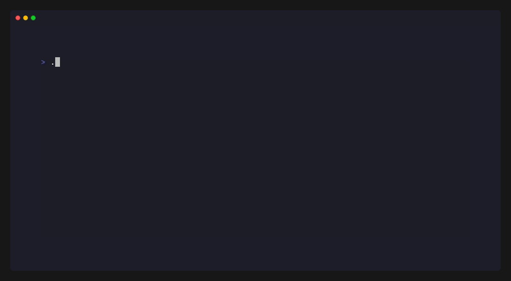

<div align="center">


# Razify

**The missing CLI tool for `.env` file management.**

Diff, scan, validate, document, and audit your environment variables.  
Offline. No cloud account. One binary. Every language.

<div align="center">
  
</div>

[](https://go.dev)
[](LICENSE)
[](https://github.com/spf13/cobra)
[](https://github.com/Hossiy21/razify/pulls)

</div>

---

## The Problem

Every development team has lost hours to `.env` issues:

- **"It works on my machine"** — environment inconsistencies across team members
- **"Which variables do I need?"** — no documentation, no standard
- **"Did someone commit a secret?"** — API keys and passwords leaked to version control
- **"What does this variable do?"** — no one remembers, original author left the team

Razify solves all four problems with a single binary.

---

## Features

| Command | What it does |
|---|---|
| `razify diff` | Compare two `.env` files and show exactly what changed |
| `razify scan` | Detect secret leaks, weak passwords, and exposed credentials |
| `razify validate` | Ensure all required variables are present before deploying |
| `razify docs` | Auto-generate markdown documentation from `.env.example` |
| `razify audit` | Full health report with a score out of 100 |
| `razify fix` | Automatically sync missing keys from .env.example to .env |
| `razify init` | Interactive wizard to bootstrap your .env.example file |
| `razify version` | Check the current version and look for updates |
| `razify guard` | Block git commits that contain exposed secrets |

---

## Installation

### Homebrew (macOS/Linux)
```bash
brew tap Hossiy21/tap
brew install razify
```

### Scoop (Windows)
```bash
scoop bucket add Hossiy21 https://github.com/Hossiy21/scoop-bucket
scoop install razify
```

### Direct Go Install
```bash
go install github.com/Hossiy21/razify@latest
```

Verify:
```bash
razify version
```

---

## Usage

### `razify diff` — Compare environments

```bash
razify diff .env .env.staging
```

```
Comparing .env → .env.staging

  ✘  MISSING in .env.staging: API_KEY
  ✔  ADDED in .env.staging:   NEW_FEATURE
  ~  CHANGED: DB_HOST
      .env: localhost
      .env.staging: staging.server.com

7 difference(s) found.
```

---

### `razify scan` — Secret leak detection

```bash
razify scan .env
razify scan .env --json
```

```
Scanning .env...

  ✘  [CRITICAL] Line 6: DB_PASSWORD
     Value : ch****me
     Reason: Weak or default value detected

  ⚠  [HIGH]     Line 5: AWS_ACCESS_KEY
     Value : AK****************LE
     Reason: Cloud provider credential

Summary: 1 CRITICAL  4 HIGH  1 MEDIUM

  ✘  ACTION REQUIRED: Never commit this file to git!
```

---

### `razify validate` — Pre-deploy validation

```bash
razify validate .env .env.example
razify validate .env .env.example --json
```

```
Validating .env against .env.example...

  ✘  [MISSING]     STRIPE_KEY
      Required key not found in .env

  ~  [PLACEHOLDER] DB_HOST
      Value looks like it was never changed from example

  ✔  [OK]          API_KEY
  ✔  [OK]          JWT_TOKEN

Summary: 6 OK   1 MISSING   2 EMPTY/PLACEHOLDER

  ✘  ACTION REQUIRED: Add missing keys before deploying!
```

---

### `razify docs` — Auto-generate documentation

```bash
razify docs .env.example
razify docs .env.example -o ENV_DOCS.md
```

```
| Variable       | Required  | Default     | Description                    |
|----------------|-----------|-------------|--------------------------------|
| `DB_HOST`      | No        | `localhost` | Primary database host          |
| `API_KEY`      | **Yes**   | —           | Main API key for external use  |
| `STRIPE_KEY`   | **Yes**   | —           | Stripe payment processing key  |

---

### `razify init` — Interactive bootstrap

```bash
razify init
```

The interactive wizard helps you create a professional `.env.example` from scratch, automatically adding validation tags like `@required` and `@type` based on your input.

---

### `razify fix` — Sync environment files

```bash
razify fix .env .env.example
razify fix .env .env.example --dry-run
```

```
Fixing .env using template .env.example...

  + Added: STRIPE_KEY
  + Added: NEW_SERVICE_URL

✔ Successfully added 2 missing keys to .env!
```
```

---

### `razify audit` — Full health report

```bash
razify audit .env .env.example
```

```
  ┌─────────────────────────────┐
  │     Razify Audit Report     │
  └─────────────────────────────┘

  ▸ Running scan...
  ▸ Running validate...
  ▸ Running diff...

  ┌─────────────────────────────┐
  │          Results            │
  └─────────────────────────────┘

  Scan        1 CRITICAL  4 HIGH  1 MEDIUM
  Validate    1 MISSING  2 PLACEHOLDER  6 OK
  Diff        7 difference(s) from .env.example

  ┌─────────────────────────────┐
  │        Health Score         │
  └─────────────────────────────┘

  5/100  Critical — needs immediate attention

  Recommendations:
  ✘  Rotate exposed credentials immediately
  ⚠  Add missing required variables before deploying
  ~  Replace placeholder values with real ones
```

---

### `razify guard` — Git commit protection

```bash
razify guard install
razify guard status
razify guard uninstall
```

```
  ✔  Razify Guard installed successfully!
     Every git commit in this repo will now be scanned.
     Commits with exposed secrets will be blocked automatically.
```

---

## CI/CD Integration

```yaml
jobs:
  validate-env:
    runs-on: ubuntu-latest
    steps:
      - uses: actions/checkout@v3

      - name: Install Razify
        run: go install github.com/Hossiy21/razify@latest

      - name: Scan for secrets
        run: razify scan .env --json

      - name: Validate environment
        run: razify validate .env .env.example --json
```

---

## JSON Output

Every command supports `--json` for scripting and AI agent integration:

```bash
razify scan .env --json
```

```json
{
  "file": ".env",
  "results": [
    {
      "line": 3,
      "key": "API_KEY",
      "value": "se*****23",
      "reason": "Looks like an API key",
      "risk": "HIGH"
    }
  ],
  "summary": {
    "critical": 1,
    "high": 4,
    "medium": 1,
    "total": 6
  }
}
```

---

## Compatibility

Works with any project that uses `.env` files.

| Framework | Compatible |
|---|---|
| React / Next.js | ✅ |
| Node.js | ✅ |
| Python / Django / FastAPI | ✅ |
| Go | ✅ |
| Laravel (PHP) | ✅ |
| Ruby on Rails | ✅ |

---

## Roadmap

- [x] `razify diff` — Compare env files
- [x] `razify scan` — Secret leak detection
- [x] `razify validate` — Required variable enforcement
- [x] `razify docs` — Auto-generate documentation
- [x] `razify audit` — Full health report
- [x] `razify guard` — Git commit protection
- [x] `razify fix` — Auto-sync missing keys
- [x] `razify init` — Interactive setup wizard
- [x] `--json` flag — AI agent and script support
- [ ] VS Code extension
- [ ] Web dashboard

---

## Contributing

```bash
git clone https://github.com/Hossiy21/razify.git
cd razify
go build .
```

---

## License

[MIT](LICENSE) — free to use, modify, and distribute.

---

<div align="center">

Made by [Hossiy21](https://github.com/Hossiy21)

</div>